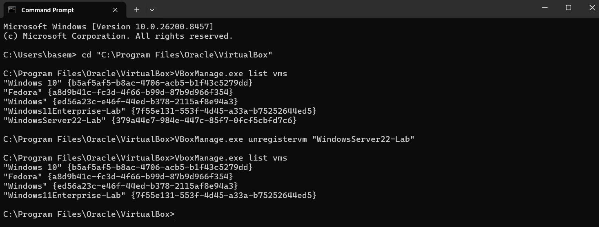
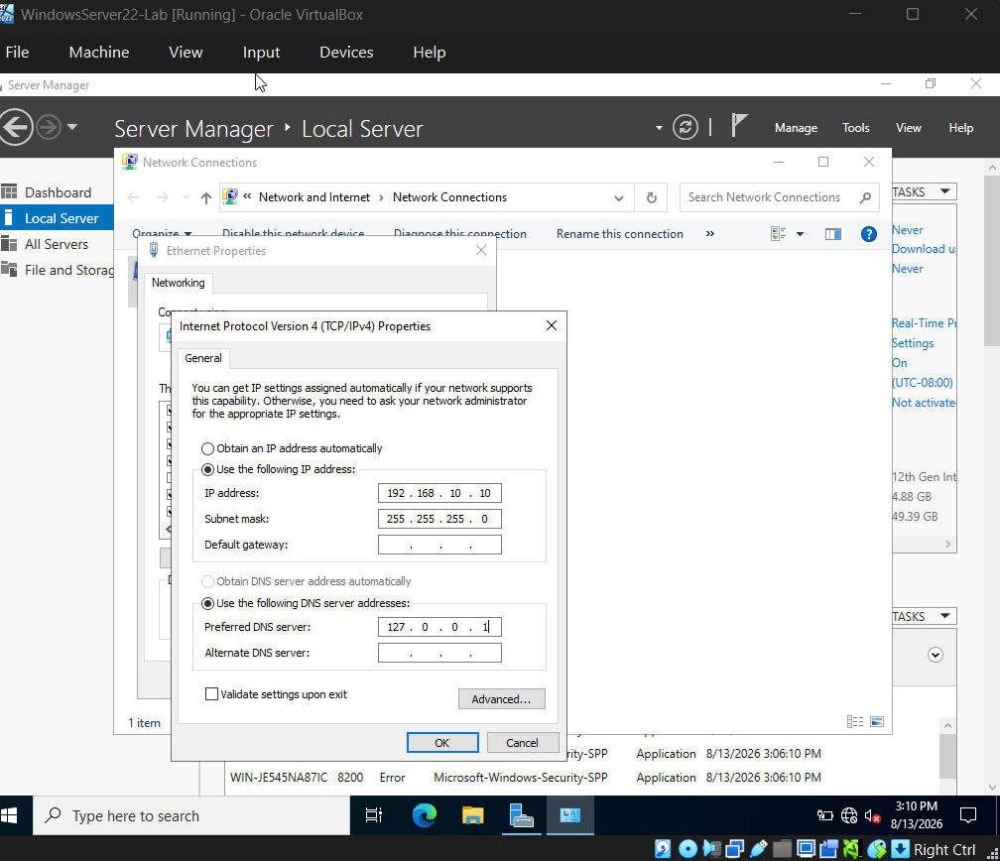
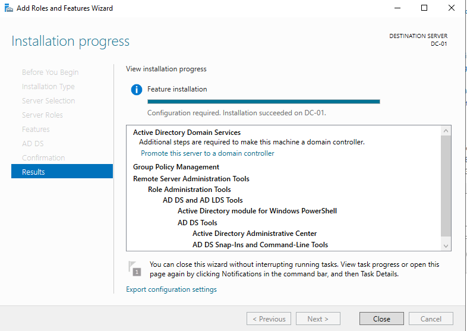
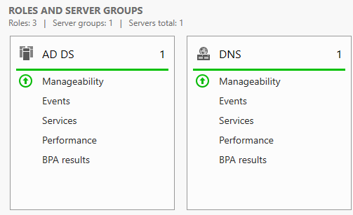
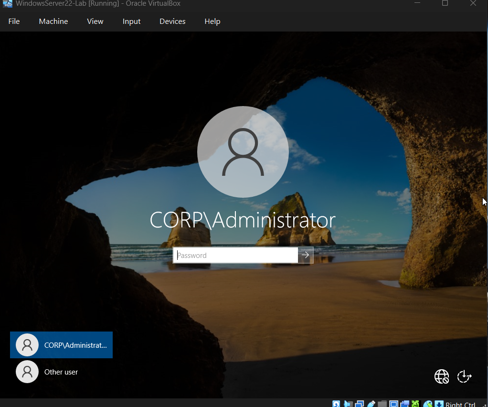
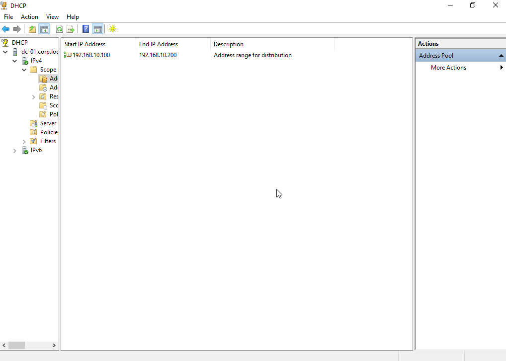
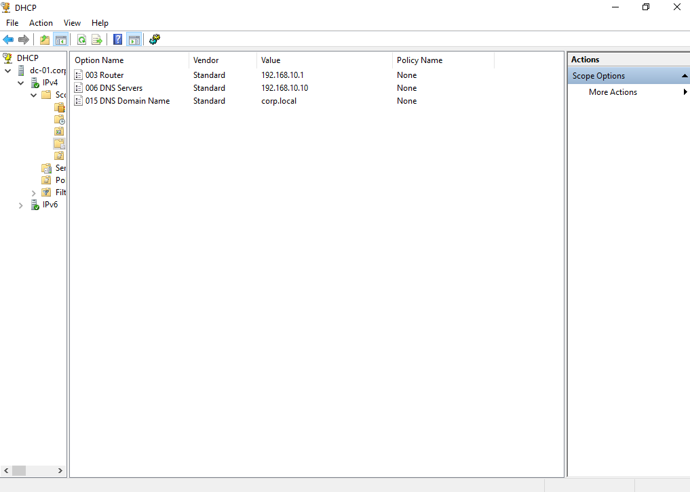
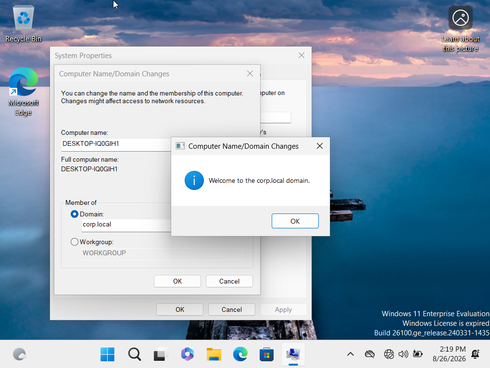
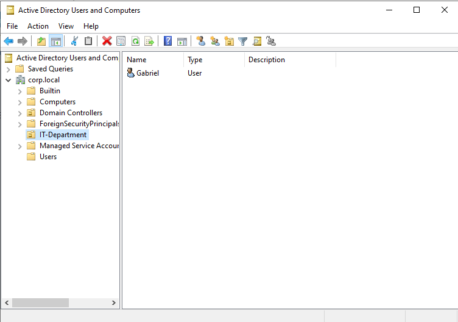
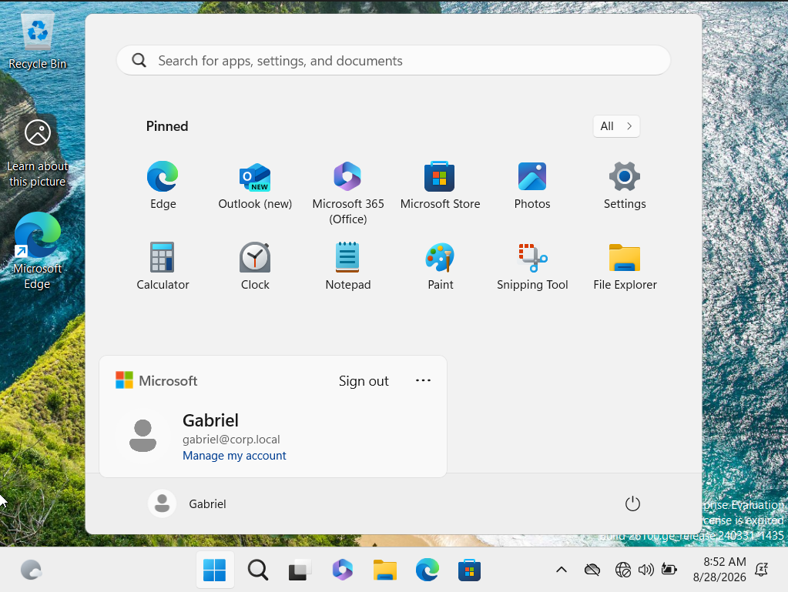

# active-directory-enterprise-lab
# Enterprise Active Directory Home Lab
A Windows Server 2022 and Windows 11 lab simulating a corporate IT environment for endpoint management, user provisioning, and Group Policy administration.

## 📌 Project Overview
This project simulates a corporate enterprise environment using virtualized infrastructure. The objective of this lab is to provision a Windows Server 2022 Domain Controller from scratch, configure foundational networking services, and deploy Active Directory Domain Services (AD DS) to manage a Windows 11 Enterprise client environment. 

**Technologies Used:**
* Oracle VM VirtualBox (Hypervisor)
* Windows Server 2022 (Domain Controller)
* Windows 11 Enterprise (Client)
* Command Line Interface (CLI / VBoxManage)
---

## 🛠️ Phase 1: Hypervisor Setup & Troubleshooting

The initial phase involved creating the isolated virtual network (`AD-Lab-Net`) and provisioning the virtual machines. 

### Resolving Hypervisor Database Desynchronization
During the initial VM provisioning, a desynchronization occurred between the VirtualBox GUI and the backend database, resulting in a UUID collision error (`E_FAIL 0x80004005`). 

Instead of relying on the GUI, I utilized the `VBoxManage` command-line tool to interface directly with the master registry. By querying the database and manually unregistering the corrupted UUID, I successfully restored functionality without data loss.

---

## 🌐 Phase 2: Network Configuration

To ensure consistent DNS resolution and reliable connectivity for the domain, the Windows Server required a static IPv4 assignment before being promoted to a Domain Controller.

* **IP Address:** 192.168.10.10
* **Subnet Mask:** 255.255.255.0
* **DNS Server:** 127.0.0.1 (Local loopback)

---

## 🏗️ Phase 3: Active Directory Provisioning

With the network foundation established, the server's identity was configured (Hostname: `DC-01`) and the Active Directory Domain Services role was deployed.

### 1. Role Installation
Successfully provisioned the AD DS role binaries onto the server.

### 2. Domain Controller Promotion
Configured a new forest root domain named `corp.local`. Validated system compatibility, passed all internal prerequisite checks, and generated the NTDS database. Verified service health post-reboot via Server Manager.

### 3. Verification
Following the final domain build and system reboot, the server successfully authenticated against the new domain database, confirming `DC-01` is now the master Domain Controller for `corp.local`.

## 📍 Phase 4: Dynamic Network Services (DHCP)

To automate IP assignment and ensure proper DNS routing for client machines joining the domain, the DHCP Server role was deployed and authorized within Active Directory.

An IPv4 scope was configured to assign addresses to the Client subnet while specifically pointing the DHCP DNS option (Option 006) back to the Domain Controller for domain resolution.

* **Scope Name:** Corp-Client-Subnet
* **IP Range:** 192.168.10.100 - 192.168.10.200
* **DNS Routing:** 192.168.10.10 (Points to DC-01)

## 🚀 Phase 5: Client Provisioning & Domain Join

Provisioned a Windows 11 Enterprise endpoint on the `AD-Lab-Net` internal network. Bypassed the consumer OOBE (Out-Of-Box Experience) to establish a local admin account.

* **DHCP & DNS Verification:** Utilized the command line (`ipconfig /all`) to verify the client successfully pulled an IP lease (`192.168.10.100`) and the correct DNS routing (`192.168.10.10`) from the server.
* **Domain Integration:** Connected the client to the `corp.local` domain via `sysdm.cpl`, successfully authenticating against the Active Directory database using Domain Admin credentials.

---

## 👥 Phase 6: Identity and Access Management (IAM)

Established foundational Helpdesk and system administration capabilities using Active Directory Users and Computers (ADUC).

* **Organizational Design:** Created an `IT-Department` Organizational Unit (OU) to logically manage technical staff and apply targeted policies.
* **User Provisioning:** Provisioned a standard domain user account (`gabriel`) with secure password configurations.
* **Authentication Verification:** Successfully logged into the Windows 11 endpoint using the domain credentials, verifying AD DS authentication and network profile generation.

---
